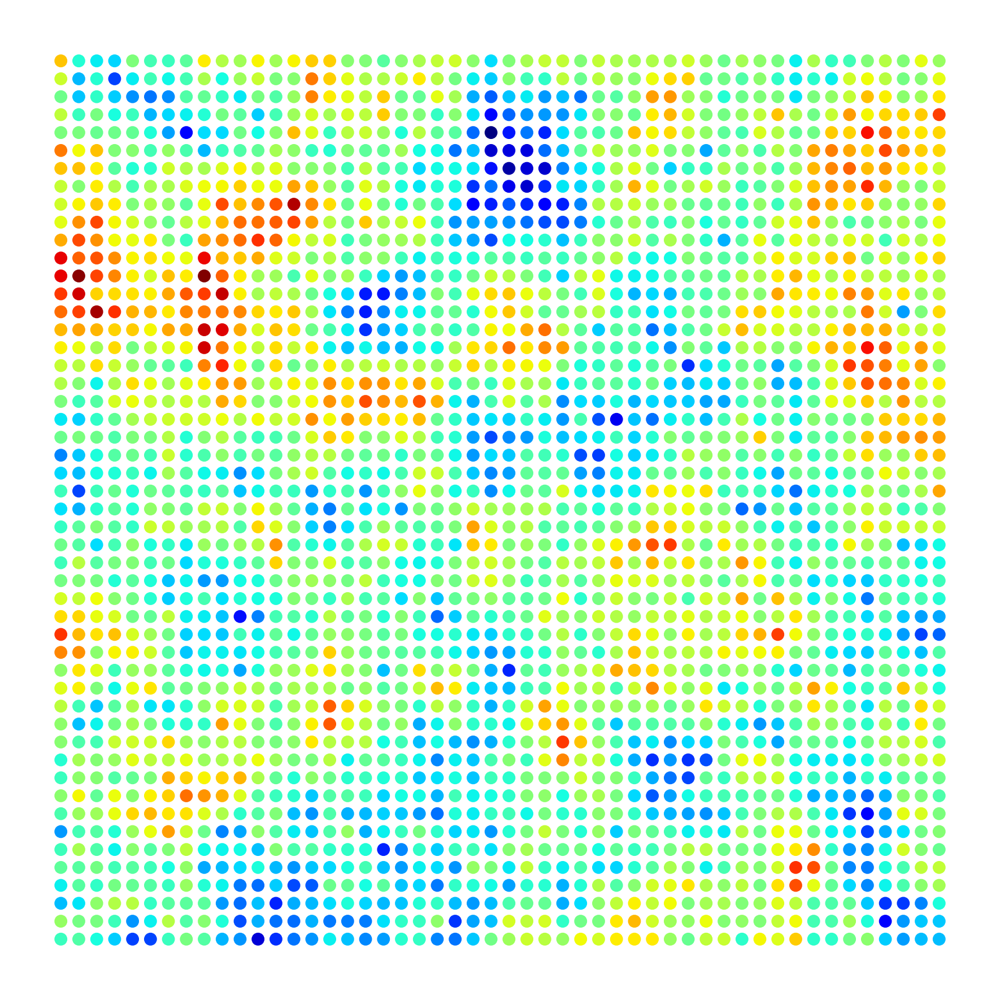

# pyrf

A simple pure-Python package for generating spatially correlated random fields.



## Getting started

Development version from GitHub:

```bash
$ pip install git+https://github.com/mark-hobbs/pypd.git
```

or for contributors using Pipenv:

```bash
$ git clone https://github.com/mark-hobbs/pypd.git
$ cd pypd/
$ pipenv install --dev
$ pipenv shell
```